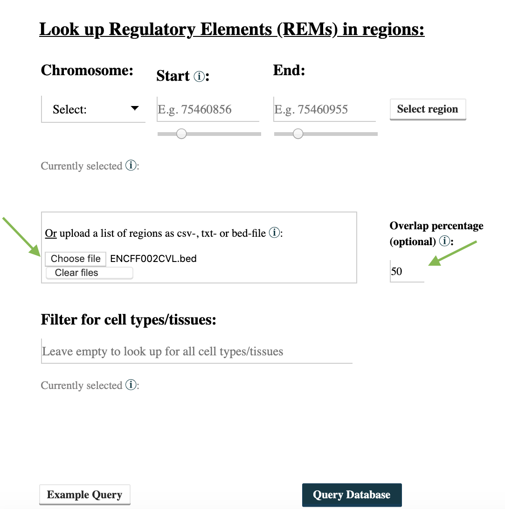
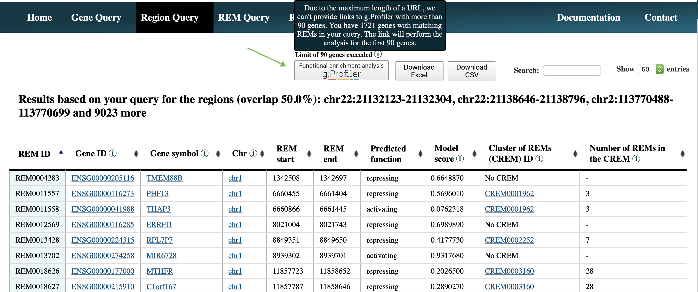
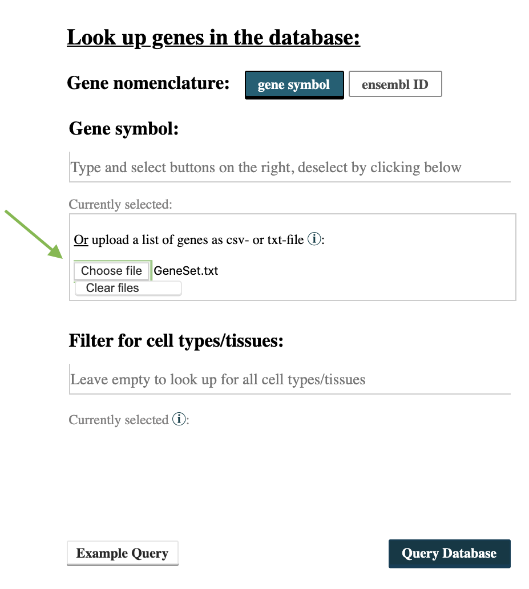
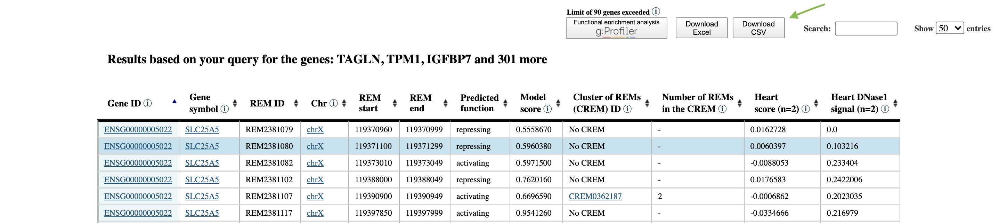
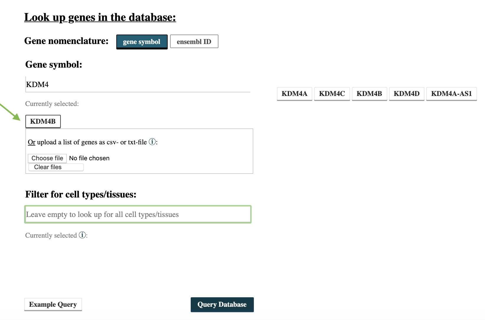

Application scenarios
---------
In this section we provide a step-by-step explanation of application scenarios of EpiRegio. Two scenarios are similar to those in our paper *EpiRegio: Analysis and retrieval of regulatory elements linked to genes* (currently in revision). 

How to use EpiRegio to identify TF's target genes using ChIP-seq peak regions
================
The application scenario is based on the section *Elucidation of disease pathways directly from a TF-ChIP experiment* from our paper. 

**Step 1:** Download the binding locations of the TF of interest, for instance from the ENCODE database as a BED file. As an example, we use the ChIP-seq peaks of TF ARID3A with the accession number ENCFF002CVL. Either click `here <https://www.encodeproject.org/files/ENCFF002CVL/>`_ to get the data from the ENCODE webpage or download it via::

  wget 'https://www.encodeproject.org/files/ENCFF002CVL/@@download/ENCFF002CVL.bed.gz'.
  

Unzip the file using e.g.::
 
    gzip -d ENCFF002CVL.bed.gz 

**Step 2:** Use EpiRegio's  `Region Query <https://epiregiodb.readthedocs.io/en/latest/UseCases.html#region-query>`_ to search for REMs overlapping at least 50% with the TF ChIP-seq peaks. Go to https://epiregio.de/regionQuery/, click *choose File* and upload the unzipped ChIP-seq peaks from Step 1. Next to the upload field, you can see an option *Overlap percentage (optional)* to define the percentage that a REM should by minimum overlap with the binding locations (50% of the binding location's length). Since we want a 50% overlap, type 50 in this field and click *Query Database*. 

 

**Step 3:** Click the bottom *Functional enrichment analysis g:Profiler* in the upper left corner, to perform a GO term enrichment analysis using g:Profiler (default parameters) of the resulting REMs. Notice, if the resulting genes are more than 90, the maximal possible length of a url is exceeded. Therefore, the first *90* genes are considered.

If you want to perform the analysis with all identified genes, please download the result by clicking *Download Excel*, open the excel file and copy the column named *Gene ID*. Go to https://biit.cs.ut.ee/gprofiler/gost and paste the copied gene IDs in the field over the *Run query* button. Then select *Run query*. Duplicate gene IDs will only be considered once. 

How to use EpiRegio to identify enriched TFs of a set of genes of interest
=================
The application scenario is based on the section *Identify enriched transcription factors of differentially expressed genes* from our paper. To perform the analysis python3 and  `bedtools <https://bedtools.readthedocs.io/en/latest/content/installation.html>`_ must be installed on your machine. You also need a current version of a human genome in fasta format, which can, for example, be downloaded on the  `UCSC webpage <https://hgdownload.soe.ucsc.edu/downloads.html#human>`_. In addition, we provide a GitHub  `repository <https://github.com/TeamRegio/ApplicationScenarioExamples/>`_ with an example file, the TF binding motifs and the motif enrichment tool `PASTAA <http://trap.molgen.mpg.de/PASTAA/>`_, which we use in Step 4. To clone the repository use:: 

	git clone https://github.com/TeamRegio/ApplicationScenarioExamples.git

In the repository the TRAP version, a script used by PASTAA, is slightly changed. We normalized the resulting TRAP affinities by the TF binding motif length.
Next go to the src folder in the cloned repository and compile PASTAA via::

	cd ApplicationScenariosExamples/src/
	make

As an example, we consider a set of differential expressed genes based on a single-cell RNAseq
data set from Glaser et al. (doi.org/10.1073/pnas.1913481117), where Human Umbilical Endothelial Cells (HUVECs) were treated with TGF-beta to trigger an endothelial-to-mesenchymal transition (EndoMT). However, the analysis works with every set of genes. If you want to perform the example, please have a look at the folder *identifyEnrichedTFs* in our GitHub repository where we provide a file called *GeneSet.txt* containing this set of genes.

**Step 1:** Use EpiRegio's `Gene Query <https://epiregiodb.readthedocs.io/en/latest/UseCases.html#query-guide>`_ to identify the REMs associated to the genes of interest. Go to https://epiregio.de/geneQuery/, click *choose File* and upload the file from Step 1. Enter *heart* in the field *Filter for cell types/tissues*. We choose heart as tissue as endothelial cells within the heart undergo EndoMT during cardiac development and we expect the regulatory processes to be comparable. If you are using an individual data set, please also choose a cell type or tissue which is most suitable for your data. Next click *Query Database*.

**Step 2:** Download the resulting table by clicking on the bottom *CSV*. TODO: add screenshot

  
**Step 3:** Next, we determine the DNA-sequence of the identified REMs using *bedtools* and run *PASTAA* to perform the motif enrichment analysis. In our GitHub repository we provide a workflow to run the analysis and a set of TF binding motifs downloaded from the JASPAR database (version 2020). To run the workflow the following command can be used:: 

  bash <pathToClonedRepo>identifyEnrichedTFs/workflow.sh <Motifs> <pathToClonedRepo> <pathToGenome> <REMs> <outputDir> <pvalue>,

where *<pathToClonedRepo>* represents the path to the cloned repository and *<Motifs>* the path to the TF motif file. You can either use the motif file we provide in our repository (ApplicationScenarioExamples/identifyEnrichedTFs/JASPAR2020_HUMAN_transfac.txt) or a self-chosen one. The motifs should be in TRANSFAC format. *<pathToGenome>* is the path to the fasta file of the human genome, *<REMs>* the path to the downloaded csv-file, and *<output>* the path to a user-defined output folder. If the Benjamini-Hochberg adjusted p-value from PASTAA is smaller than or equal to the parameter *<pvalue>* the motif is assumed to be significant enriched. For this example, set the *<pvalue>* to 0.05. The resulting significant enriched TF motifs are stored in <outputDir>/PASTAA_result.txt. 

How to use EpiRegio to identify TF-binding sites within REMs of a gene of interest
=================

To perform the analysis `bedtools <https://bedtools.readthedocs.io/en/latest/content/installation.html>`_ must be installed on your machine. You also need a current version of a human genome in fasta format, which can, for example, be downloaded on the  `UCSC webpage <https://hgdownload.soe.ucsc.edu/downloads.html#human>`_. 

**Step 1:** Use Epiregio’s `Gene Query <https://epiregiodb.readthedocs.io/en/latest/UseCases.html#query-guide>`_ to identify REMs associated to your gene of interest. In this example we want to perform the analysis for the gene KDM4B.  Go to https://epiregio.de/geneQuery/, enter KDM4B in the field *Gene symbol*. After typing several letters, gene names containing the entered letters will appear. Click at KDM4B and the gene name is listed under *Currently selected*. Next select *Query Database*.

**Step 2:** After the query is done, download the table with the resulting REMs by clicking on the bottom *CSV*. Before we can determine the DNA-sequence of the REMs, we need to format the CSV file to a bed file with the following command::

	awk 'NR!=1{print $4 "\t" $5 "\t" $6}' <yourCSVFile>  >REMs.bed,
	
where *<yourCSVFile>* represents the file you just downloaded from the server. Using bedtools getFasta command, we are able to extract the DNA-sequences of the REMs::

	<pathToBedtools>/bedtools getfasta -fi <humanGenome> -bed REMs.bed -fo REMs.fa
	
*<pathToBedTools>* represents the path to your bedtools source folder (if not included in your environment variables) and *<humanGenome>* the path to a file containing the human genome in fasta format.

**Step 3:** To identify TF-binding sites, we use the tool *Fimo* from MEME suite. *Fimo* requires the DNA-sequences of the REMs from Step 2 and a set of known TF binding motifs. In our GitHub  `repository <https://github.com/TeamRegio/ApplicationScenarioExamples/>`_ we provide human motifs from the JASPAR database (version 2020) in meme format. You can clone the repository using:: 

	git clone https://github.com/TeamRegio/ApplicationScenarioExamples.git

The TF-binding motif file is located in *ApplicationScenarioExamples/identifyTFBindingSites/JASPAR2020_HUMAN_meme.txt*.
Go to http://meme-suite.org/tools/fimo, in the section *Input the motifs* click *choose file* and upload the motifs. Next click at *Ensembl Ab initio Predicted Proteins* in the section *Input the sequences* and select *Upload sequences*.  A field where you can upload the DNA-sequences will appear. To do so, select *Choose file* and upload the fasta file from Step 2. Click *Start search*. Note that it can take some minutes until the calculations are done.

