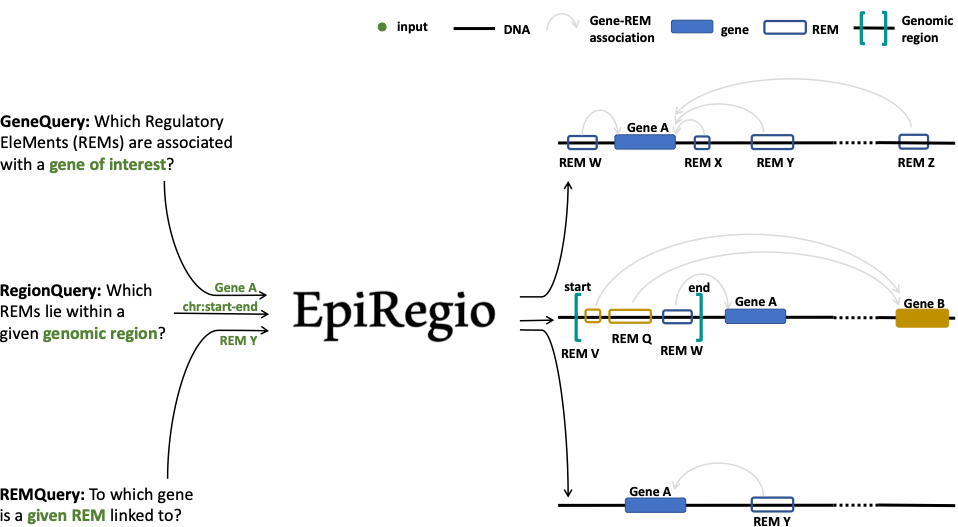
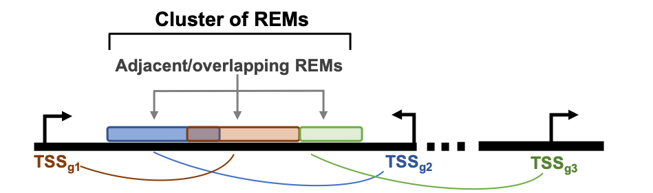
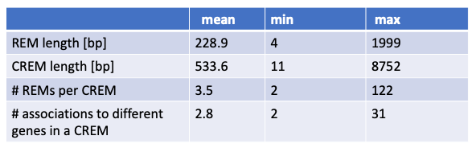

About `EpiRegio <https://epiregio.de/>`_ Web Server
===================================================
The field of research on gene regulation has considerably grown during the last years
and the acknowledgement of its importance in orchestrating the genetic landscape has expanded.
One of the key players are non-coding DNA regions, which regulate gene expression. They are able to enhance or repress the expression of their associated genes.
These Regulatory EleMents (REMs) can be located far away from their associated genes.
Identifying REMs is difficult, as there is no method yet to determine them with abolute certainty.
Different computational approaches are being used, combining various kinds of genomics data to annotate REMs. An even
more challenging task is to link the putative REMs to their associated gene.

Here we present the `EpiRegio <https://epiregio.de/>`_ web server, a resource of REMs, providing information about their associated gene, their relevance for their gene's expression and their activity in different cell types and tissues. With EpiRegio users are enabled to look into regions of interest, analyze the genomic locations that impact the expression of specific genes and access details about the regulatory elements.

Overview of possible queries 
===============================================

Learning of Regulatory EleMents (REMs)
===============================
EpiRegio is based on *STITCHIT*, a method which was previously developed in our group. It is a peak-calling free approach to identify gene-specific REMs by analyzing epigenetic signal of diverse human cell-types with regard to gene expression of a certain gene. In order to identify REMs, a large genomic area around a gene of interest is partitioned into distinct regions, which show variation in their epigenetic profile correlating with changes in gene expression.
*STITCHIT* is applied to large collections of paired, uniformly processed DNase1-seq and RNA-seq samples from Roadmap, ENCODE and Blueprint. *STITCHIT* was shown to outperform peak based approaches e.g. GeneEnhancer and UnifiedPeaks regarding the accuracy and resolution. Furthermore, we validated results from *STITCHIT* with external data such as ChIA-PET and Promoter-Capture Hi-C data. To show the functional advantage of *STITCHIT*, various analyses were performed, like the rediscovery of known enhancers and the partitioning of larger regulatory elements into smaller regions. Additionally, CRISPR-Cas9 experiments were done to illustrate the reliability of *STITCHIT* [2]. 

For more information, a detailed explanation of the computational method and the evaluation of the results, please have a look at our `bioRxiv <http://dx.doi.org/10.1101/585125>`_ preprint.

Cluster of regulatory elements
===============================

  
The way STITCHIT identifies REMs results in REMs that are mapped to one gene. Genomic locations are not exclusive to REMs, hence REMs associated to different genes can overlap which each other. Consequently the overlapping region is linked to more than one gene. To account for these overlapping REMs, we introduce the term Cluster of Regulatory EleMents (CREM). One CREM consists of all REMs that overlap with each other or that are adjacent to each other without any break in between (see the schema above). A CREM ends when there is no neighbouring REM to either side of it. Each CREM is composed of a minimum of two REMs and is assigned to a unique ID. In other words, a CREM can be considered as one coherent regulatory region that is potentially associated to multiple genes, where it is known which part links to which gene.

Data preprocessing for the EpiRegio webserver
===============================
The data hosted by the web server EpiRegio was generated with *STITCHIT*. 
*STITCHIT* was applied to human paired DNase1-seq and RNA-seq data, namely *110* samples from the Roadmap consortium and *56* samples from the Blueprint consortium.
The considered samples comprise of *46* different tissues and cell types. While the Blueprint data set consists of various primary cell types and disease related samples associated to the haematopoietic system, Roadmap data provides a broader diversity of cell and tissue types. All data sets have been uniformly preprocessed. DNase1-seq was adjusted to sequencing depth and gene expression is quantified in transcripts per million.
For every gene, *STITCHIT* inspects a user-defined region around the gene to determine putative associated REMs. For the data provided in EpiRegio, we consider a window of *100,000* bp upstream of a gene's transcription start site, the entire gene body and the window of *100,000* bp downstream of a gene's transcription termination site. Hence, even distant REMs are taken into account. 
In total *EpiRegio* contains *2,404,861* REMs associated to *35,379* protein-coding and non-protein coding genes. Together, they form *365,286* distinct CREMs. In the following table quantitative characteristics of REMs and CREMs are summarized.

Future releases
===============================
We will continuously update and expand EpiRegio. Besides of adding more functionalities and analyses, we will also update the underlying dataset if we can make improvements by including new datasets or by tweaking processes of STITCHIT. Right now, version 1 is available. Every file you export contains the current day and the version number. All dataset versions are available at our `Zenodo repository <https://zenodo.org/record/3758494#.Xp6JVi2w2Rt>`_, so that you can still reproduce all your analyses even after a version upgrade. We also upload the source code of every release on `Zenodo <https://zenodo.org/record/3753196#.XphMH1MzbOQ>`_.

Cite Us
=======
If you use this webserver, please cite the following:

1. Nina Baumgarten, Dennis Hecker, Sivarajan Karunanithi, Florian Schmidt, Markus List, Marcel H Schulz, EpiRegio: analysis and retrieval of regulatory elements linked to genes, Nucleic Acids Research, , gkaa382, https://doi.org/10.1093/nar/gkaa382
2. Schmidt et. al., `Integrative analysis of epigenetics data identifies gene-specific regulatory elements <http://dx.doi.org/10.1101/585125>`_
