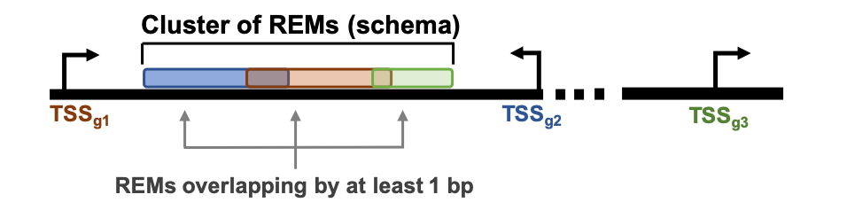

About
======
The field of research on gene regulation has considerably grown during the last years
and the acknowledgement of its importance in orchestrating the genetic landscape has expanded.
One of the key players are non-coding DNA regions, which regulate gene expression
by remodelling the accessibility of chromatin. They are able to support or repress the expression of their associated genes.
These Regulatory EleMents (REMs) can be located far away from their associated genes.
Identifying REMs is difficult, as there is no method yet to get a clear readout of their sequence.
Different computational approaches are being used, combining various kinds of genomics data to annotate REMs. An even
more challenging task is to link the putative REMs to their associated gene.

Here we present the _`EpiRegio webserver <https://epiregio.de/>`_, a resource of REMs, providing information about their associated gene, their relevance for its gene's expression and their activity in different cell types and tissues. With EpiRegio users are enabled to look into regions of interest, analyze the genomic locations that impact the expression of specific genes and access details about the regulatory elements.

Overview of possible queries 
===============================================
.. image:: ./images/overview_withoutDB.png
  :width: 600
  :alt: Overview of possible queries 

Learning of Regulatory EleMents (REMs)
===============================
EpiRegio is based on STITCHIT, a method which was previously developed in our group. It is a peak-calling free approach to identify gene-specific REMs by analyzing epigenetic signal of diverse human cell-types with regard to gene expression of a certain gene. In order to identify REMs, a large genomic area around a gene of interest is partitioned into distinct regions, which show variation in their epigenetic profile correlating with changes in gene expression.
STITCHIT is applied to large collections of paired, uniformly processed DNase1-seq and RNA-seq samples from Roadmap, ENCODE and Blueprint. STITCHIT was shown to outperform peak based approaches e.g. GeneEnhancer and UnifiedPeaks regarding the accuracy and resolution. Furthermore, we validated results from STITCHIT with external data such as ChIA-PET and Promoter-Capture Hi-C data. To show the functional advantage of STITCHIT, various analyses were performed, like the rediscovery of known enhancers and the partitioning of larger regulatory elements into smaller regions. Additionally, CRISPR-Cas9 experiments were done to illustrate the reliability of STITCHIT[2]. 

For more information, a detailed explanation of the computational method and the evaluation of the results, please have a look at our `bioRxiv <http://dx.doi.org/10.1101/585125>`_ preprint.

Cluster of regulatory elements
===============================

  
We define a cluster of regulatory elements as genomic region that contains single REMs overlapping by at least 1 bp. A cluster can also consist of only one REM, if it does not overlap with any other REM. These clusters give the opportunity to look into the regulatory potential of neighbouring elements and their associated genes.

Cite Us
=======
If you use this webserver, please cite the following:

1. Baumgarten et. al., Analysis and retrieval of regulatory elements linked to genes with EpiRegio
2. Schmidt et. al., `Integrative analysis of epigenetics data identifies gene-specific regulatory elements <http://dx.doi.org/10.1101/585125>`_
