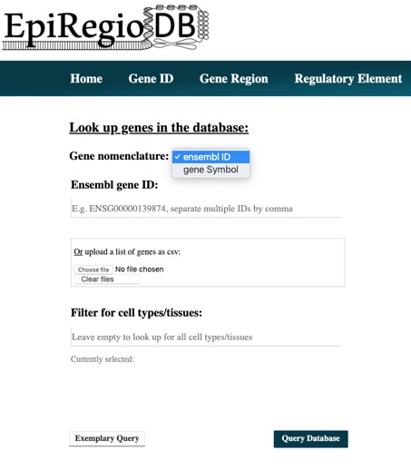
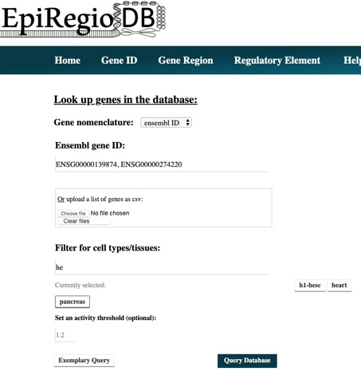
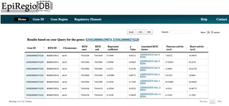

Use Cases
---------
xx

Gene based search
=================

Do you wish to search for Regulatory Elements (REMs) related to a specific gene? 

a. Go to the Gene ID tab. 
b. You can choose to search either with Ensembl ID (The version number of ensembl gene ID is not required.) or gene symbol.

c. When you have multiple IDs or symbols to search, please make a CSV file and upload it. 
d. Choosing cell types/tissues:

Start typing in the cell type of your interest, and the server suggests the available cell types matching your query. You can only choose from them. The DNase activity of the REMs associated with your gene of interest for the chosen cell type will be displayed. You can also set a threshold on the DNase activity, and only REMs above that threshold will be displayed. 
e. The result page shows the information related to the related REMs, and the DNase activity for the cell types chosen previously. Additionally, if a REM is part of a cluster of REMs (overlapping REMs), their information is also displayed.

REM based search
=================

xx

Region based search
===================

xx
