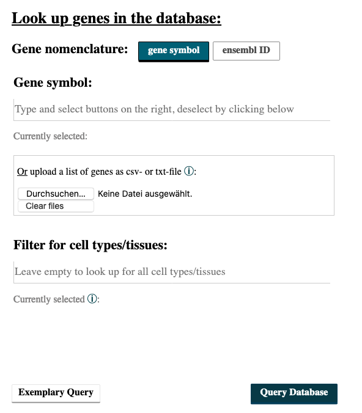
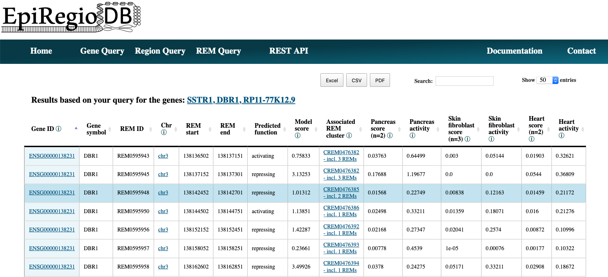
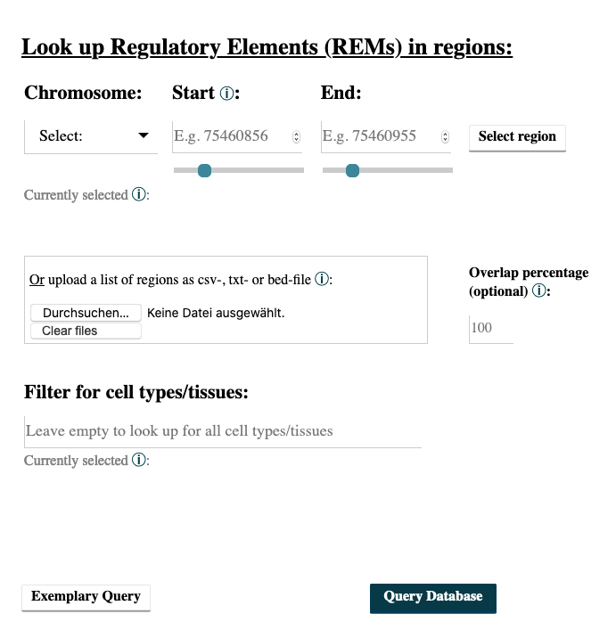
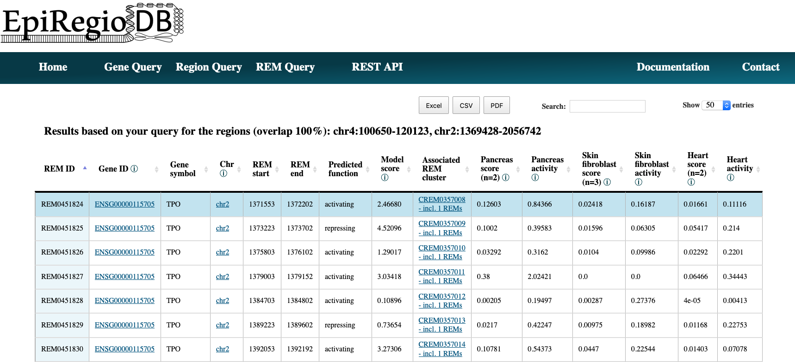
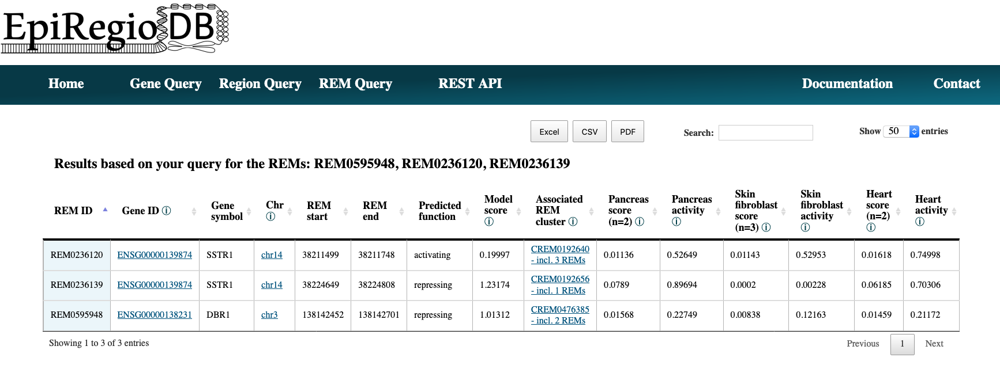

Query Guide
---------
Here we provide a step-by-step guide for every query available, including an explanation of the output. Every query has an *Examplary Query* button at the  bottom of the page. Try it out to see how a valid query would look like. Have a look at :ref:`Results in detail` to get an explanation of all the output parameters. 

Gene Query
=================

Do you wish to search for Regulatory Elements (REMs) related to a specific gene? 

.. image:: ./images/mini_overview_gene.png
  :width: 600
  :alt: Gene Query mini overview

1. Go to the *Gene Query* tab. 

2. You can choose to search either with *ensembl ID* or *gene symbol*. The version number of Ensembl IDs is not required. When entering gene symbols, you can add suggestions on the right by clicking on the appearing buttons. Selected buttons will be listed underneath *Currently selected:*. Deselect your choices by reclicking on those buttons. We use the human genome version hg38.

3. When you have multiple IDs or symbols to search, separate them by comma in the input field or create a csv- or txt-file and upload it. All of the commonly used separators are being recognized. A combination of both, the input field and the uploaded file, is not implemented.

4. Choosing cell types/tissues: Start typing in the field *Filter for cell types/tissues:* the cell types of your interest, and suggesstions of available cell types/tissues matching your query will appear. To select a cell type, click on the button on the right. Cell types you write but do not select via a button click will not be considered for the query. To deselect click again on the button below *Currently selected:*. The cell type score and cell type activity of the REMs associated with your chosen genes will be added as columns to the output table for all cell types you selected. Once you selected a cell type/tissue, a new input field will appear, which gives the option to choose an activity threshold. This threshold refers to the DNase activity of the REMs in the cell types/tissues. Only REMs that exceed the threshold in **ALL** of the cell types you selected will be shown in the output table. Leave the field empty to get back all REMs independent of their activity. 

.. image:: ./images/geneQuery_cellTypes.png
  :width: 800
  :alt: Cell type/tissue selection

5. The result page shows the information based on your query settings. All the REMs associated to your queried genes are listed with their location, their predicted function, the model score, the REM cluster they are belonging to and their activity in the cell types you selected. The *Model score* indicates how important a REM is for its associated gene over all cell types. The higher the value, the more important the REM is. The next column *Associated REM cluster* contains the ID of the cluster this REM is contained in. A cluster of REMs consists of all the REMs that overlap by at least 1 bp. Click on a CREM ID to get more information on this particular cluster and its REMs. If you selected cell types in your query, the *Cell type score* and the *Cell type activity* of the REMs in these cell types will be shown as average over all the samples n in the database. The *Cell type score* is the absolute product of the regression coefficient and the DNase activity, indicating how important a REM is in this cell type. The higher the value, the higher the REMs expected contribution to its gene's expression in this cell type. *Cell type activity* is the DNase signal alone. You can export the table as xls-, csv- or pdf-file. For more details on the genes you queried, click on the link at the top of the table. 

Region Query
===================

Do you wish to search for Regulatory Elements (REMs) being located in a specific genomic region? 

.. image:: ./images/mini_overview_region.png
  :width: 600
  :alt: Region Query mini overview

1. Go to the *Region Query* tab. 

2. You can enter a region by choosing a chromosome, the start and the end point and then clicking on the *Select* button. Add as many regions as you like. Deselect your choices by reclicking on the added buttons. Only REMs that are located in your chosen regions will be given as output. You can select the percentage of overlap. For example, with an overlap of 50% only the REMs will be returned that overlap by at least half of their length with your selected regions.

3. You can also upload a csv-, txt- or bed-file with your regions of interest in which the first value has to be the chromosome, followed by the start and the end position. A combination of both, input field and uploaded file, is not implemented. You can see the format of exemplary upload files below (comma-separated and tab-separated). All of the commonly used separators are being recognized, as long as the order of chromosome, start position and end position is correct. For the bed-files, the columns have to be in the order chromsome, start position and end position as well. All additional columns beside of those first three ones will be ignored. Files with empty fields will not be read correctly. 

  

  

  

4. Choosing cell types/tissues: Start typing in the field *Filter for cell types/tissues:* the cell types of your interest, and suggesstions of available cell types matching your query will appear. To select a cell type click on the button on the right. Cell types written but not selected via a button click will not be considered for the query. To deselect click again on the button below *Currently selected:*. The cell type score and the cell type activity of the REMs associated with your chosen genes will be added as columns to the output table for all the cell types you selected. Once you selected a cell type, a new input field will appear, which gives the option to choose an activity threshold. This threshold refers to the DNase activity of the REMs in the cell types. Only REMs that exceed the threshold in **ALL** of the cell types you selected will be shown in the output table. Leave the field empty to get back all REMs independent of their activity. 

.. image:: ./images/geneQuery_cellTypes.png
  :width: 800
  :alt: Cell type/tissue selection
  
  
5. The result page shows the information based on your query settings. All the REMs located inside of your selected regions are listed with their associated gene, their predicted function, the model score, the REM cluster they belong to and their activity in the cell types you selected. The *Model score* indicates how important a REM is for its associated gene over all cell types. The higher the value, the more important the REM is. The next column *Associated REM cluster* contains the ID of the cluster this REM is contained in. A cluster of REMs consists of all the REMs that overlap by at least 1 bp. Click on a CREM ID to get more information on this particular cluster and its REMs. If you selected cell types in your query, the *Cell type score* and the *Cell type activity* of the REMs in these cell types will be shown as average over all the samples n in the database. The *Cell type score* is the absolute product of the regression coefficient and the DNase activity, indicating how important a REM is in this cell type. The higher the value, the higher the REMs expected contribution to its gene's expression in this cell type. *Cell type activity* is the DNase signal alone. You can export the table as xls-, csv- or pdf-file.

REM Query
=================

Do you wish to search for Regulatory Elements (REMs) by their ID? 

.. image:: ./images/mini_overview_REM.png
  :width: 600
  :alt: Gene Query mini overview

1. Go to the *REM Query* tab. 

2. Enter the IDs of your REMs of interest. Sepearte multiple ones by comma. You can upload a csv-file containing REM IDs. A combination of both, input field and uploaded file, is not implemented.

.. image:: ./images/2802REMQueryForm.png
  :width: 400
  :alt: REMQuery form

3. Choosing cell types/tissues: Start typing in the field *Filter for cell types/tissues:* cell types of your interest, and suggesstions of available cell types matching your query will appear. To select a cell type click on the button on the right. Cell types written but not selected via a button click will not be considered for the query. To deselect click again on the button below *Currently selected:*. The DNase activity of the REMs associated with your chosen genes will be added as columns to the output table for all the cell types you selected. Once you selected a cell type, a new input field will appear, which gives the option to choose an activity threshold. This threshold refers to the DNase activity of the REMs in the cell types. Only REMs that exceed the threshold in **ALL** of the cell types you selected will be shown in the output table. Leave the field empty to get back all REMs independent of their activity. 

.. image:: ./images/geneQuery_cellTypes.png
  :width: 800
  :alt: Cell type/tissue selection

4. The result page shows the information based on your query settings. All your queried REMs are listed with their associated gene, their predicted function, the model score, the REM cluster they are belonging to and their activity in the cell types you selected. The *Model score* indicates how important a REM is for its associated gene over all cell types/tissues. The higher the value, the more important the REM is. The next column *Associated REM cluster* contains the ID of the cluster this REM is contained in. A cluster of REMs consists of all the REMs that overlap by at least 1 bp. Click on a CREM ID to get more information on this particular cluster and its REMs. If you selected cell types in your query, the *Cell type score* and the *Cell type activity* of the REMs in these cell types will be shown as average over all the samples n in the database. The *Cell type score* is the absolute product of the regression coefficient and the DNase activity, indicating how important a REM is in this cell type. The higher the value, the higher the REMs expected contribution to its gene's expression in this cell type. *Cell type activity* is the DNase signal alone. You can export the table as xls-, csv- or pdf-file.

Interactive tables
=================

All result tables possess additional functionalities like the possibility to filter for certain values or to sort the table by a selected column. Moreover, there are several links included. For every REM you can click on the chromosome value in its row to view this REM's region inside of the `UCSC Genome Browser <https://genome.ucsc.edu/>`_. The values in the column *Associated REM cluster* redirects you to a new table with all the REM contained in this cluster. Further, each *Gene ID* in all the tables is also a link that brings you to a new table in which all the REMs are shown that are associated with this gene. After performing a Gene Query, you can click the gene ID in the query header to get to a table containing more details that we have about your queried genes. In addition, inside of this table the gene IDs will redirect you to the gene's `GeneCard <https://www.genecards.org/>`_.

Available cell and tissue types
=================
In case you are wondering, whether your cell type or tissue is availale on EpiRegio, we list the available ones here. Every name is written as you would find it in the field where you filter for cell types (without the bullet point of course). 

The following cell/tissue types are available from Roadmap. Please note that we list the cell/tissue type (biosample) names as listed in the ENCODE website, which also hosts the Roadmap data. :

.. hlist::
  :columns: 3
  
  * skin fibroblast
  * fibroblast of skin of abdomen 
  * imr-90
  * trophoblast cell  
  * muscle of arm 
  * stomach
  * muscle of back
  * small intestine
  * muscle of leg
  * large intestine
  * left lung
  * kidney
  * right lung 
  * thymus
  * heart
  * renal cortex
  * adrenal gland
  * renal pelvis
  * left kidney
  * left renal cortex
  * left renal pelvis
  * right renal pelvis
  * spinal cord
  * right renal cortex interstitium
  * spleen
  * psoas muscle
  * muscle of trunk
  * ovary
  * pancreas
  * testis
  * forelimb muscle
  * hindlimb muscle
  * h1-hesc

From Blueprint we included the following cell types:

.. hlist::
  :columns: 2
  
  * "cd8-positive, alpha-beta t cell"
  * "cd14-positive, cd16-negative classical monocyte"
  * acute lymphocytic leukemia
  * macrophage
  * "cd34-negative, cd41-positive, cd42-positive megakaryocyte cell"
  * "cd4-positive, alpha-beta t cell"
  * erythroblast
  * macrophage
  * inflammatory macrophage
  * acute myeloid leukemia
  * chronic lymphocytic leukemia
  * macrophage – b-glucan
  * cd14-positive monocyte

Results in detail
=================
The tables you get from the different queries contain the same columns. Here you can get some more detailed information on each of them.

Gene ID and symbol
~~~~~~~
For the gene nomenclature we use the hg38 human genome version from the `Ensembl Genome Browser <https://www.ensembl.org/Homo_sapiens/Info/Index?db=core>`_. For each gene ID we have one gene symbol available. If a queried gene symbol is called to be invalid, try to use the ENSG ID (e.g. ENSG00000000001), as they are more definite. 

REM ID
~~~~~~~
*REM ID* is how we define the REMs internally. Each *REM ID* is unique.  Also the REMs, which have the exact same genomic region but are associated to different genes (happens rarly), are assigned to different *REM IDs*. We start counting from REM0000001 onwards.

Predicted function
~~~~~~~
STITCHIT identifies REMs by interpreting differential gene expression, meaning that a REM can be associated with an increase in gene expression as well as with a decrease. This association is represented by the regression coefficient. In case of a positive regression coefficient we assume an activating effect of the REM on its target gene's expression and for a negative regression coefficient a repressing effect.

Model score
~~~~~~~
The *Model score* is the absolute binary logarithm of the p-value for the association between a REM and its target gene. It serves as an indicator how important a REM is for the expression prediction of its target gene. The higher the score, the more impact the REM is supposed to have. This value is not cell type specific as it is calculated over all cell types. It allows for a comparison in between the REMs but not in between cell types. For a cell type-specific comparison, have a look at the *Cell type score*.

Associated REM cluster
~~~~~~~
As STITCHIT determine REMs for each gene seperately and not the other way around, the identified regions can overlap. A *REM cluster* is a region of neighbouring REMs that overlap by at least one base pair (bp). If there is no overlapping other REM, a cluster can also consist of only one REM. Each *REM cluster*  is assigned to a unique *REM cluster ID*. We start counting from CREM0000001 onwards. By clicking on the *Associated REM cluster* ID you get forwareded to a table with all REMs inside of this cluster. 

Cell type score
~~~~~~~
*Cell type score* is the absolute product of the regression coefficient and the DNase1 activity in a REM, indicating how important a REM is in this cell type. The higher the value, the higher the REMs expected contribution to its target gene's expression in this cell type. The regression coefficient is not cell type-specific, but the DNase1 activity is. Therefore, the *Cell type score* can be used to rank REMs according to their importance between cell types for the same gene or to rank REMs within one cell type.

Cell type activity
~~~~~~~
*Cell type activity* is the DNase1 signal for the cell type of interest measured in the REM region. It is normalized for sequening depth and can be used to compare the activity of REMs between samples. As we have more than one sample for each cell type, we took the average activity of those samples.
