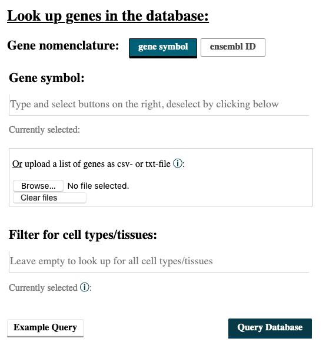
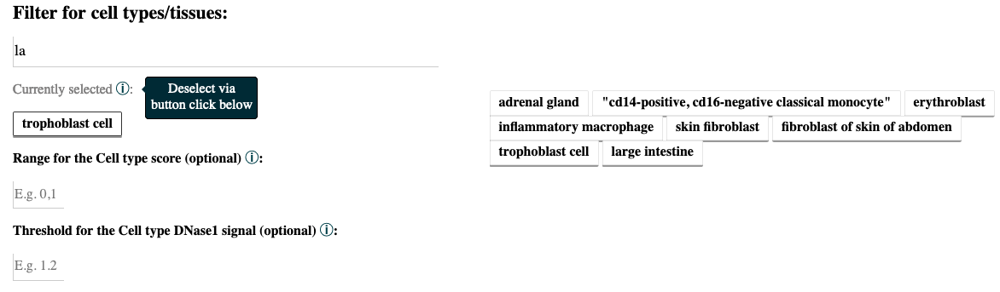
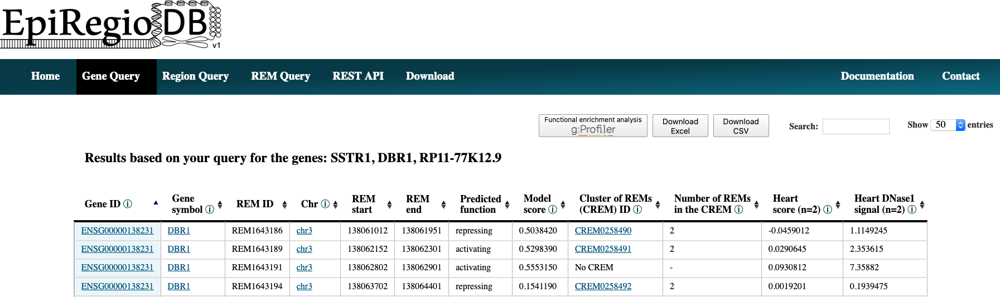
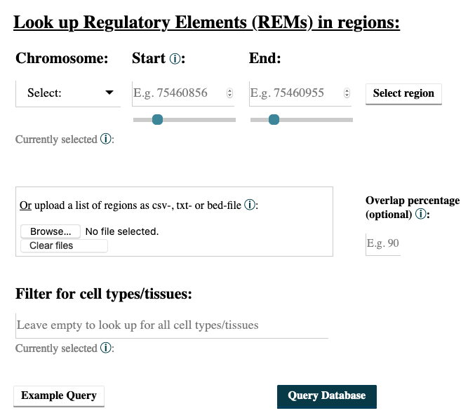
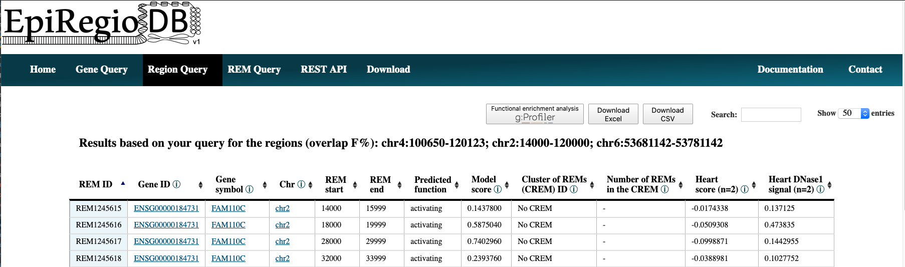
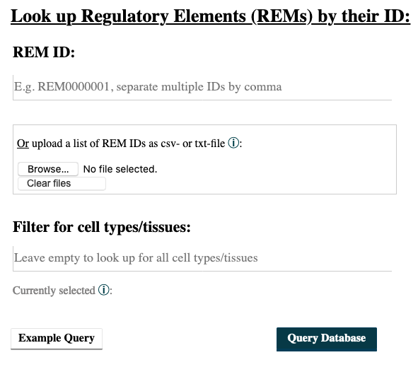
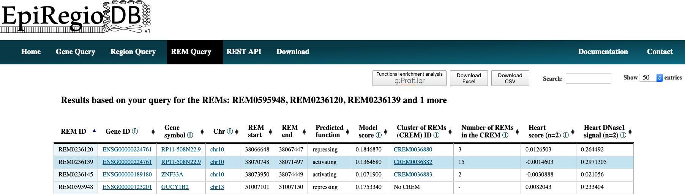
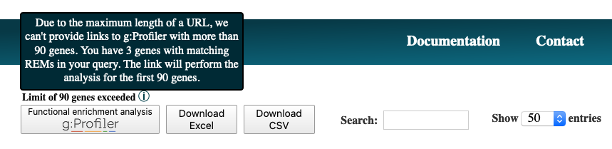
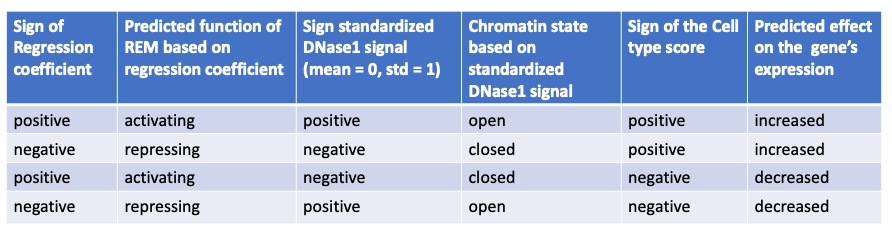

Query Guide
---------
Here we provide a step-by-step guide for every query available, including an explanation of the output. Every query has an *Example Query* button at the  bottom of the page. Try it out to see how a valid query would look like. Have a look at :ref:`Results in detail` to get an explanation of all the output parameters. In addition, we provide an example file for each possible file upload, see :ref:`Examples file upload`.

Gene Query
=================

Do you wish to search for Regulatory Elements (REMs) related to a specific gene? 

.. image:: ./images/mini_overview_gene.png
  :width: 600
  :alt: Gene Query mini overview

1. Go to the *Gene Query* tab. 

2. You can choose to search either with *gene symbol* or *ensembl ID*. The version number of Ensembl IDs is not required. When entering gene symbols, you can add them from the suggestions appearing on the right by clicking on the buttons. Selected buttons will be listed underneath *Currently selected:*. Deselect your choices by reclicking on those buttons. We use the human genome assembly version GRCh38.p10.

3. When you have multiple IDs or symbols to search, separate them by comma in the input field or create a csv- or txt-file and upload it. All of the commonly used separators are being recognized. A combination of both, the input field and the uploaded file, is not implemented.

4. Choosing cell types/tissues: Start typing in the field *Filter for cell types/tissues:* the cell types of your interest, and suggesstions of available cell types matching your query will appear. To select a cell type, click on the button on the right. Cell types you write but do not select via a button click will not be considered for the query. To deselect click again on the button below *Currently selected:*. If your cell type does not appear, have a look at the :ref:`Available cell and tissue types` section and see whether you can find it there. 

  
Once you selected a cell type, two new input fields will appear, which give the option to choose thresholds. The thresholds refer to the *Cell type score* and the *Cell type DNase1 signal* of the REMs in the cell types/tissues. Only REMs that exceed the thresholds in **ALL** of the cell types you selected will be shown in the output table. The threshold for the *Cell type score* requires a range (e.g. 0-1). You can filter for the absolute *Cell type scores* if you write it like |0.5,1|. It is possible to set just one or both thresholds. Leave the fields empty to get back all REMs independent of their score and DNase1 signal.  

5. The result page shows the information based on your query settings. All the REMs associated to your queried genes are listed with their location, their *Predicted function*, the *Model score*, the REM cluster they are belonging to and their activity in the cell types you selected. The *Model score* [0,1] indicates how important a REM is for its associated gene over all cell types. The closer the value is to 1, the more important the REM is. The next column *Cluster of REMs (CREM) ID* contains the ID of the cluster this REM is contained in. A cluster of REMs consists of all the REMs that are directly adjacent with no base pair in between or that overlap with each other. Click on a CREM ID to get to a table with all REMs of this CREM. We provide a more detailed description of CREMs `here <https://epiregiodb.readthedocs.io/en/latest/Description.html#cluster-of-regulatory-elements>`_. If you selected cell types in your query, the *Cell type score* and the *Cell type DNase1 signal* of the REMs in these cell types will be shown as average over all the samples n in the database (for each cell type separately, not averaged over all cell types). The *Cell type score* [-1,1] is the normalized product of the regression coefficient and the standardized DNase1 activity, indicating the relative contribution of a REM to its target gene's expression in this cell type. The higher the value, the higher is the REM region expected to have an activating effect on its gene's expression in this cell type. This does not necessarily mean that the REM is an activator. The REM could also be a repressor but the chromatin is closed at its location. For more detailed informations about the *Cell type score* see `here <https://epiregiodb.readthedocs.io/en/latest/UseCases.html#model-score>`_. *Cell type Dnase1 signal* is the DNase1 signal, indicating the chromatin accessibility in the REM region. If you need some more information on the genes themselves, click on the *Gene ID* to get to the respective Ensembl web page. By clicking on the *Gene symbol* you will receive a table with all REMs that are associated to the clicked gene. To see the REM region in the `UCSC Genome Browser <https://genome.ucsc.edu/>`_ click on the chromosome entry. Another option is to use the 'Functional enrichment analysis' button to perform an analysis of all genes in the table with `g:Profiler <https://biit.cs.ut.ee/gprofiler/gost>`_ on default settings. The limit for genes that can be included in the g:Profiler link is 90. You will get a notification if this limit is exceeded. The link will still work, but contain only the first 90 unique genes. You can export the table as xls- or csv-file. The downloaded file's name is adapted to your query and contains the date as well as the current version of the website. 

Region Query
===================

Do you wish to search for Regulatory Elements (REMs) being located in a specific genomic region? 

.. image:: ./images/mini_overview_region.png
  :width: 600
  :alt: Region Query mini overview

1. Go to the *Region Query* tab. 

2.  You can enter a region by choosing a chromosome, the start and the end point and then clicking on the *Select* button. Add as many regions as you like. Deselect your choices by reclicking on the added buttons. Only REMs that are located in your chosen regions will be given as output. You can select the percentage of overlap and by this define how much of your selected region has to be covered by a REM for this REM to be shown in the output. For example, with an overlap of 50% only the REMs that cover at least half of a region's length will be returned. Per default only REMs that are located completely within your regions are reported.

3. You can also upload a csv-, txt- or bed-file with your regions of interest, see :ref:`Examples file upload`.  
  
4. Choosing cell types/tissues: The selection of cell types functions in the same way as described above in the :ref:`Gene Query` at point 4.
  
  
5. The output is very similar for all queries. Have a look at point 5 of the :ref:`Gene Query` or at the :ref:`Results in detail`. Below you can see how the output of the Region query looks like.

REM Query
=================

Do you wish to search for Regulatory Elements (REMs) by their ID? 

.. image:: ./images/mini_overview_REM.png
  :width: 600
  :alt: Gene Query mini overview

1. Go to the *REM Query* tab. 

2. Enter the IDs of your REMs of interest. Sepearte multiple ones by comma. You can upload a csv-file containing REM IDs. A combination of both, input field and uploaded file, is not implemented.

3. Choosing cell types/tissues: The selection of cell types functions in the same way as described above in the :ref:`Gene Query` at point 4.

4. The output is very similar for all queries. Have a look at point 5 of the :ref:`Gene Query` or at the :ref:`Results in detail`. Below you can see how the output of the REM query looks like.

Interactive tables
=================

All result tables possess additional functionalities like the possibility to filter for certain values or to sort the table by a selected column. Moreover, there are several links included. Each *Gene ID* in the tables is a link that gets you to the entry of this gene from the `Ensembl genome browser <https://www.ensembl.org/index.html>`_ from the Ensembl release 91. The original annotation that the model was trained on is `GENCODE V27 <https://www.gencodegenes.org/human/release_27.html>`_. The entries in *Gene symbol* creates a new table with all the REMs that are associated to the clicked gene. Further, you can click on the chromosome value in a row to view the REM's region inside of the `UCSC Genome Browser <https://genome.ucsc.edu/>`_. The values in the column *Cluster of REMs (CREM) ID* redirect you to a new table with all the REM contained in this cluster. In addition, the button 'Functional enrichment analysis' runs an analysis on all the genes currently in the table with `g:Profiler <https://biit.cs.ut.ee/gprofiler/gost>`_ on default settings. With more than 90 unique genes, the link exceeds the maximum characters possible for URLs. You will get a warning if that happens (see below). You can still use the link, but it will only contain the first 90 unique genes of your query. To do the functional enrichment analysis with all genes, you could download the excel-file, copy the *Gene ID* column and paste it in `g:Profiler <ttps://biit.cs.ut.ee/gprofiler/gost>`_.

Examples file upload
=================
It is also possible to upload a csv-, txt- or bed-file for the different queries. A combination of both, input field and uploaded file, is not implemented. All of the commonly used separators are being recognized, however files with empty fields will not be read correctly. 
For the region query it is important that the order of chromosome, start position and end position is correct. If a bed-file is provided for the this query, the columns have to be in the order chromsome, start position and end position as well. All additional columns beside of those first three ones will be ignored. 
For the gene query you still need to specifiy the *gene nomenclature*, either *gene name* or *ensembl id* according to the one used in your uploaded file. 

In the following you can download an example for each query:
  
.. hlist::
  :columns: 1
  
  * :download:`Gene query <./files/ExampleFile_GeneQuery.txt>`
  * :download:`Region query <./files/ExampleFile_RegionQuery.bed>`
  * :download:`REM query <./files/ExampleFile_REMQuery.txt>`
  

Available cell and tissue types
=================
In case you are wondering, whether your cell type or tissue is availale on EpiRegio, we list the available ones here. Every name is written as you would find it in the field where you filter for cell types (without the bullet point of course). 

The following cell/tissue types are available from Roadmap. Please note that we list the cell/tissue type (biosample) names as listed in the ENCODE website, which also hosts the Roadmap data. :

.. hlist::
  :columns: 3
  
  * skin fibroblast
  * fibroblast of skin of abdomen 
  * imr-90
  * trophoblast cell  
  * muscle of arm 
  * stomach
  * muscle of back
  * small intestine
  * muscle of leg
  * large intestine
  * left lung
  * kidney
  * right lung 
  * thymus
  * heart
  * renal cortex
  * adrenal gland
  * renal pelvis
  * left kidney
  * left renal cortex
  * left renal pelvis
  * right renal pelvis
  * spinal cord
  * right renal cortex interstitium
  * spleen
  * psoas muscle
  * muscle of trunk
  * ovary
  * pancreas
  * testis
  * forelimb muscle
  * hindlimb muscle
  * h1-hesc

From Blueprint we got the following cell types:

.. hlist::
  :columns: 2
  
  * "cd8-positive, alpha-beta t cell"
  * "cd14-positive, cd16-negative classical monocyte"
  * acute lymphocytic leukemia
  * macrophage
  * "cd34-negative, cd41-positive, cd42-positive megakaryocyte cell"
  * "cd4-positive, alpha-beta t cell"
  * erythroblast
  * macrophage
  * inflammatory macrophage
  * acute myeloid leukemia
  * chronic lymphocytic leukemia
  * macrophage – b-glucan
  * cd14-positive monocyte

Results in detail
=================
The tables you get from the different queries contain the same columns. Here you can get some more detailed information on each of them.

Gene ID and symbol
~~~~~~~
For the gene nomenclature we use the hg38 human genome version from the `Ensembl Genome Browser <https://www.ensembl.org/Homo_sapiens/Info/Index?db=core>`_. For each gene ID we have one gene symbol available. If a queried gene symbol is called to be invalid, try to use the ENSG ID (e.g. ENSG00000000001), as they are more definite. 

REM ID
~~~~~~~
*REM ID* is how we define the REMs internally. Each *REM ID* is unique. Also the REMs, which have the exact same genomic region but are associated to different genes (happens rarly), are assigned to different *REM IDs*. We start counting from REM0000001 ascending.

Predicted function
~~~~~~~
STITCHIT identifies REMs by interpreting differential gene expression, meaning that a REM can be associated with an increase in gene expression as well as with a decrease. This association is represented by the regression coefficient. In case of a positive regression coefficient we assume an activating effect of the REM on its target gene's expression and for a negative regression coefficient a repressing effect.

Model score
~~~~~~~
The *Model score* is the absolute binary logarithm of the p-value of the regression coefficient for the association between a REM and its target gene. To normalize the model score in the range [0, 1], we diveded the values by the maximal value. Consequently, at least one REM out of the REMs associated to a gene, has the highest value 1. The *Model score* serves as an indicator on how important a REM is for the expression prediction of its target gene in relation to the other REMs associated to that gene. The closer the score is to 1, the more impact the REM is supposed to have. This value is not cell type specific as it is based on the regression coefficient, which is calculated over all cell types. It allows for a comparison in between the REMs but not in between cell types. For a cell type-specific comparison, have a look at the *Cell type score*.

Cluster of REMs (CREM) ID
~~~~~~~
As STITCHIT determines REMs for each gene seperately, the identified REMs for different genes can overlap. A *REM cluster* is a region of neighbouring REMs that are directly adjacent or that overlap with each other. There has to be a minimum of two neighbouring REMs to be called a CREM. Each *REM cluster* is assigned to a unique *CREM ID*. We start counting from CREM0000001 ascending. By clicking on the *Cluster of REMs (CREM) ID* you get forwareded to a table with all REMs inside of this cluster. We show a schema of a CREM `here <https://epiregiodb.readthedocs.io/en/latest/Description.html#cluster-of-regulatory-elements>`_.

Number of REMs per CREM
~~~~~~~
This shows how many REMs are contained in the CREM to which the REM belongs to. If the row is empty, then the REM does not have any adjacent or overlapping REMs and therefore is not considered as a cluster. 

Cell type score
~~~~~~~
*Cell type score* is a normalized quantity in range [−1,1], which represents the relative contribution of a REM (:math:`r`) to its gene's expression in a cell type-specific manner (:math:`c`). We defined the *Cell type score* as following:

  
The  regression  coefficient  (β)  describes  the  association between a REM and its gene’s expression. The DNase1 signal is  log-transformed  and  standardized  for  each  REM  over  all cell types (mean=0, standard deviation=1) and represents how active  a  REM  is  in  a  cell  type :math:`c`. :math:`R` is  defined  as  the  set  of all  REMs  associated  to  a  given  gene,  thus :math:`R={r_1, ..., r_n}`. The *Cell type score* normalizes the contribution of REM :math:`r` to its gene’s expression in this specific cell type as predicted by the linear model of STITCHIT. Notice, that the sum of the absolute value of the *Cell type score* of REMs associated to a gene for one cell type :math:`c`, adds up to 1. So, we do not expect to observe *Cell type scores* to be 1 or close to 1, as we do for the *Model score*. 
A positive *Cell type score* indicates an expected increase of the gene's expression in comparison to the other considered cell types and a negative value has a decreasing effect. There are two possible scenarios when observing a positive cell type score: 

  1) The REM has a positive regression coeffiecient and the cell type’s DNase1 signal is higher than the mean over all considered cell types (positive value). This means that the REM is an activator and the chromatin is open, so the REM is likely to enhance the gene’s expression in comparisons to cell types, where the chromatin is more closed.
  
  2) The REM has a negative regression coefficient and the cell type’s DNase1 signal is lower than the mean over all considered cell types (negative value). In other words, the REM is a repressor of the gene, but the chromatin is rather closed, so the REM is most likely not able to regulate the gene’s expression. This leads to a higher gene expression in comparison to cell types where the chromatin is more open.
  
There are also two scenarios to observe a negative cell type score: 

  1) The REM has a positive regression coefficient and the cell type's DNase1 signal is lower than the mean over all considered cell types (negative value). This means that the REM is interpreted as an activator, but the chromatin is closed. Thus, the REM is most likely not able to regulate the expression of the gene. Consequently, the gene expression is decreased in comparsion to a cell type where the chromatin is more open. 
  
  2)  The REM has a negative regression coefficient and the cell type’s DNase1 signal is higher than the mean over all considered cell types (positive value). Therefore, the REM is a repressor and the chromatin is rather open. This leads to a decreasing gene expression in comparsion to a cell type where the chroamtin is more closed. 
 
The following table summarizes how to interpret the *Cell type score*:

The *Cell type score* can be used to rank REMs according to their importance between cell types for the same gene or to rank REMs within one cell type.

Cell type DNase1 signal
~~~~~~~
*Cell type DNase1 signal* is the DNase1 signal for the cell type of interest measured in the REM region. It is normalized for sequencing depth and can be used to compare the activity of REMs between samples. As we can have more than one sample for each cell type, we take the average activity of those samples. The activity was obtained from the Roadmap and Blueprint consortia and is no parameter calculated by STITCHIT. 
