Query Guide
---------
Here we provide a step-by-step guide for every query available, including an explanation of the output. Every query has an *Examplary Query* button at the  bottom of the page. Try it out to see how a valid query would look like. 

Gene Query
=================

Do you wish to search for Regulatory Elements (REMs) related to a specific gene? 

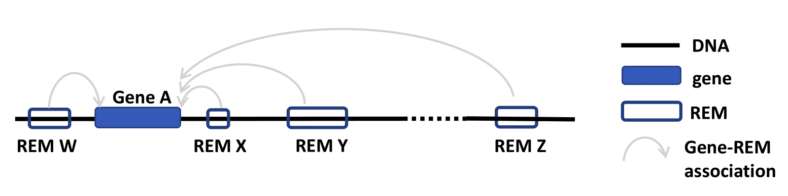

1. Go to the *Gene Query* tab. 

2. You can choose to search either with *ensembl ID* or *gene symbol*. The version number of Ensembl IDs is not required. When entering gene symbols, you can add suggestions on the right by clicking on the appearing buttons. Selected buttons will be listed underneath *Currently selected:*. Deselect your choices by reclicking on those buttons. We use the human genome version hg38.

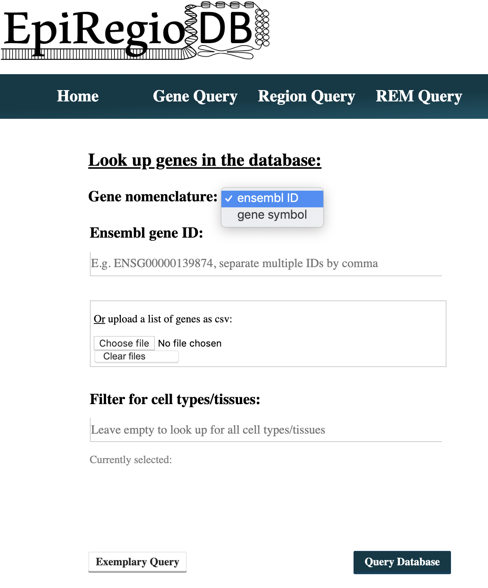

3. When you have multiple IDs or symbols to search, separate them by comma in the input field or create a csv-file and upload it. A combination of both, the input field and the uploaded file, is not implemented.

4. Choosing cell types/tissues: Start typing in the field *Filter for cell types/tissues:* cell types/tissues of your interest, and suggesstions of available cell types/tissues matching your query will appear. To select a cell type/tissue, click on the button on the right. Cell types/tissues written but not selected via a button click will not be considered for the query. To deselect click again on the button below *Currently selected:*. The DNase activity of the REMs associated with your chosen genes will be added as columns to the output table for all cell types/tissues you selected. Once you selected a cell type/tissue, a new input field will appear, which gives the option to choose an activity threshold. This threshold refers to the DNase activity of the REMs in the cell types/tissues. Only REMs that exceed the threshold in **ALL** of the cell types/tissues you selected will be shown in the output table. Leave the field empty to get back all REMs independent of their activity. 

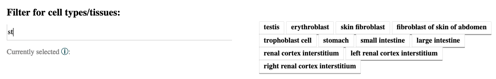

5. The result page shows the information based on your query settings. All the REMs associated to your queried genes are listed with their location, their predicted function, the model score, the REM cluster they are belonging to and their activity in the cell types/tissues you selected. The *model score* indicates how important a REM is for its associated gene over all cell types/tissues. The higher the value, the more important the REM is. The next column *Associated REM cluster* contains the ID of the cluster this REM is contained in. A cluster of REMs consists of all the REMs that overlap by at least 1 bp. Click on a CREM ID to get more information. If you selected cell types/tissues in your query, the DNase activity of the REMs in these cell types/tissues will be shown as average over all the samples n in our database. You can export the table as xls-, csv- or pdf-file. For more details on the genes you queried, click on the link at the top of the table.

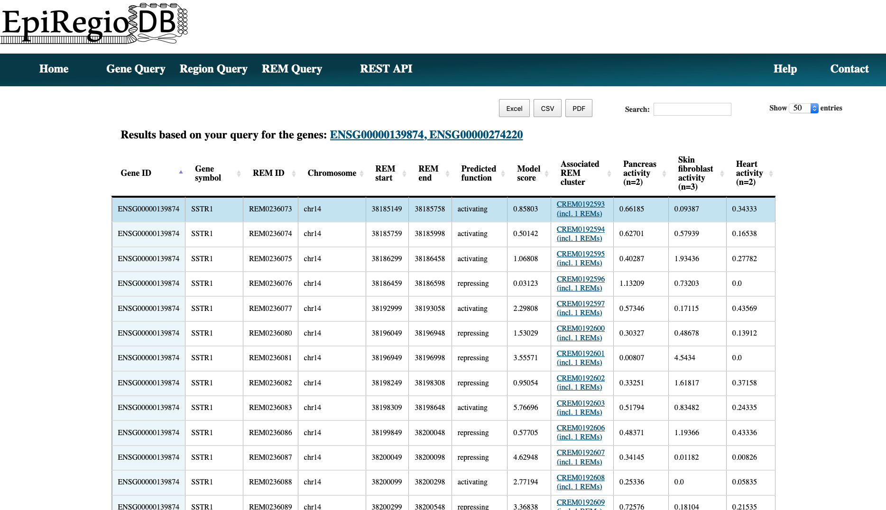

Region Query
===================

Do you wish to search for Regulatory Elements (REMs) being located in a specific genomic region? 

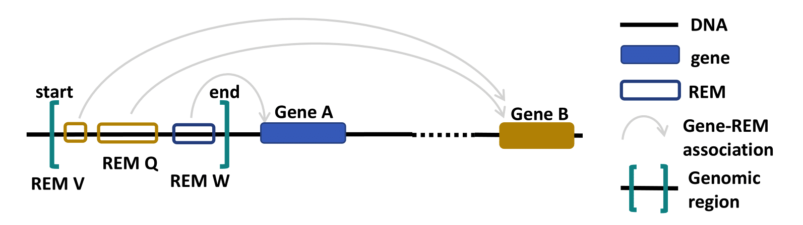

1. Go to the *Region Query* tab. 

2. You can enter a region by choosing a chromosome, the start and the end point and then clicking on the *Select* button. Add as many regions as you like. Deselect your choices by reclicking on the added buttons. Only REMs that are located entirely in your chosen regions will be given as output. The selectable start and end positions are based on the regions we have data for, either genes or REMs, respective to the selected chromosome. The range of the sliders adapt to the selected chromosome as well. Outside of those regions, there are no putative REMs located. An error message will notify you, if your chosen positions are laying outside the regions covered by our data.

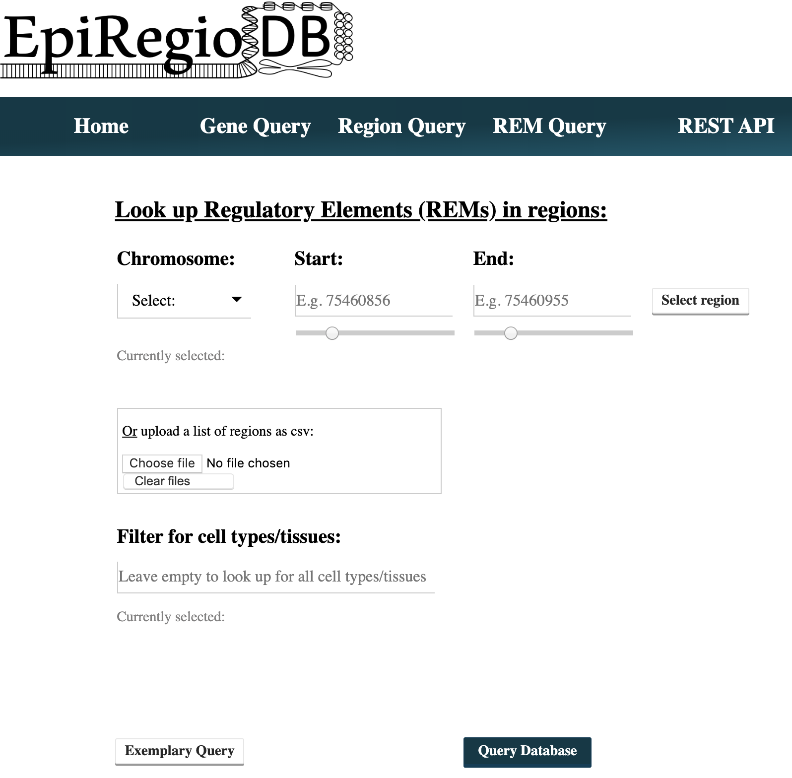

3. You can also upload a csv-file with your regions of interest in which the first value has to be the chromosome, followed by the start and the end position. A combination of both, input field and uploaded file, is not implemented. You can see the format of exemplary upload files below (comma-separated and tab-separated. All of the commonly used separators are being recognized, as long as the order of chromosome, start position and end position is correct. The possibility to upload BED-files will be included in the next release.

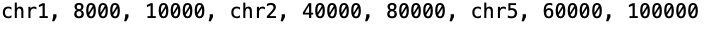
  

  
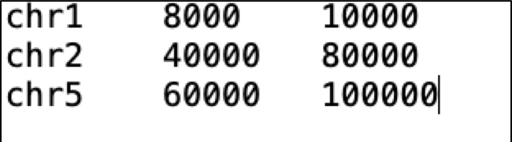
  

4. Choosing cell types/tissues: Start typing in the field *Filter for cell types/tissues:* cell types/tissues of your interest, and suggesstions of available cell types/tissues matching your query will appear. To select a cell type/tissue click on the button on the right. Cell types/tissues written but not selected via a button click will not be considered for the query. To deselect click again on the button below *Currently selected:*. The DNase activity of the REMs associated with your chosen genes will be added as columns to the output table for all the cell types/tissues you selected. Once you selected a cell type/tissue, a new input field will appear, which gives the option to choose an activity threshold. This threshold refers to the DNase activity of the REMs in the cell types/tissues. Only REMs that exceed the threshold in **ALL** of the cell types/tissues you selected will be shown in the output table. Leave the field empty to get back all REMs independent of their activity. 

  
  
5. The result page shows the information based on your query settings. All the REMs located inside of your selected regions are listed with their associated gene, their predicted function, the model score, the REM cluster they belong to and their activity in the cell types/tissues you selected. The *model score* indicates how important a REM is for its associated gene over all cell types/tissues. The higher the value, the more important the REM is. The next column *Associated REM cluster* contains the ID of the cluster this REM is contained in. A cluster of REMs consists of all the REMs that overlap by at least 1 bp. Click on a CREM ID to get more information. If you selected cell types/tissues in your query, the DNase activity of the REMs for each cell types/tissues will be shown as average over all samples *n* in our database. You can export the table as xls-, csv- or pdf-file. For more details on the genes you queried, click on the link at the top of the table.

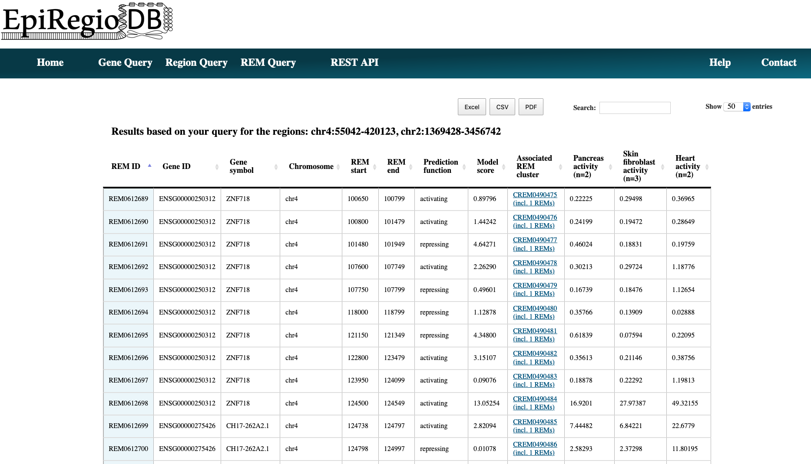

REM Query
=================

Do you wish to search for Regulatory Elements (REMs) by their ID? 

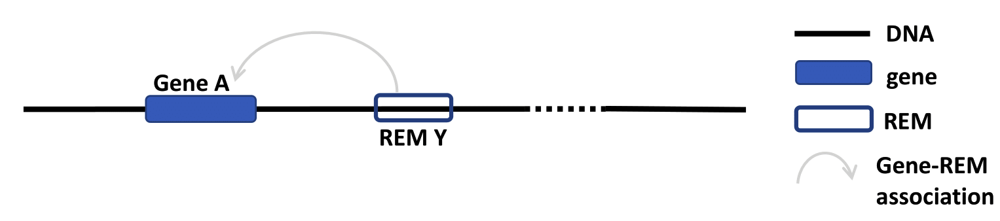

1. Go to the *REM Query* tab. 

2. Enter the IDs of your REMs of interest. Sepearte multiple ones by comma. You can upload a csv-file containing REM IDs. A combination of both, input field and uploaded file, is not implemented.

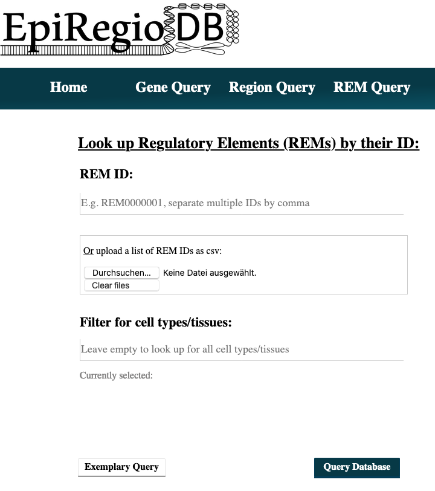

3. Choosing cell types/tissues: Start typing in the field *Filter for cell types/tissues:* cell types/tissues of your interest, and suggesstions of available cell types/tissues matching your query will appear. To select a cell type/tissue click on the button on the right. Cell types/tissues written but not selected via a button click will not be considered for the query. To deselect click again on the button below *Currently selected:*. The DNase activity of the REMs associated with your chosen genes will be added as columns to the output table for all the cell types/tissues you selected. Once you selected a cell type/tissue, a new input field will appear, which gives the option to choose an activity threshold. This threshold refers to the DNase activity of the REMs in the cell types/tissues. Only REMs that exceed the threshold in **ALL** of the cell types/tissues you selected will be shown in the output table. Leave the field empty to get back all REMs independent of their activity. 

4. The result page shows the information based on your query settings. All your queried REMs are listed with their associated gene, their predicted function, the model score, the REM cluster they are belonging to and their activity in the cell types/tissues you selected. The *model score* indicates how important a REM is for its associated gene over all cell types/tissues. The higher the value, the more important the REM is. The next column *Associated REM cluster* contains the ID of the cluster this REM is contained in. A cluster of REMs consists of all the REMs that overlap by at least 1 bp. Click on a CREM ID to get more information. If you selected cell types/tissues in your query, the DNase activity of the REMs in these cell types/tissues will be shown as mean over all the samples n in our database. You can export the table as xls-, csv- or pdf-file. For more details on the genes you queried, click on the link at the top of the table.

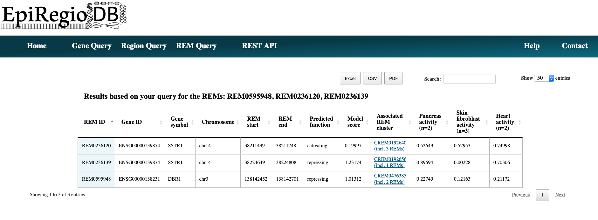

